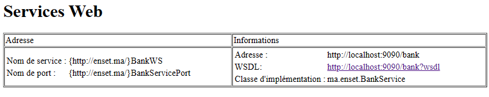
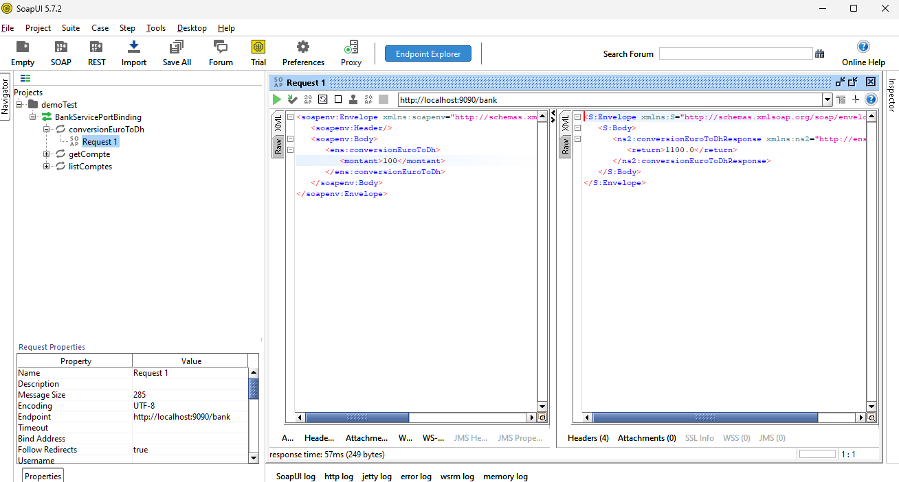
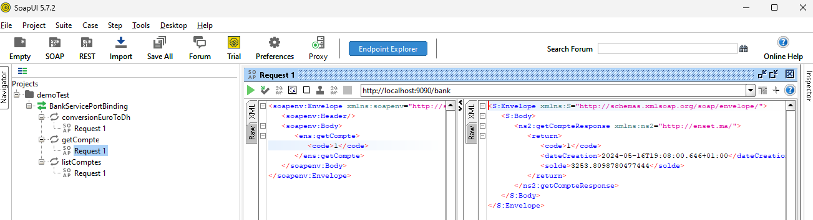

# SOAP Web Service Demo

Ce projet démontre comment créer et consommer un service Web SOAP en utilisant JAX-WS et Java.

## Fonctionnalités

- Conversion de l'euro en dirhams marocains (DH)
- Consultation des détails d'un compte
- Liste de comptes

## Prérequis

- Java Development Kit (JDK)
- Apache Maven
- SoapUI (ou tout autre outil de test SOAP)

## Déploiement du Service Web

1. Clonez le dépôt:
   ```bash
   git clone https://github.com/elmouaddibe/soap-web-service-demo.git
   cd soap-web-service-demo
   ```

2. Compilez et exécutez le service:
   ```bash
   mvn clean install
   ```

3. Accédez à l'URL suivante pour voir le WSDL:
   ```
   http://localhost:9090/bank?wsdl
   ```
   

## Tester avec SoapUI

1. Ouvrez *SoapUI* et créez un nouveau projet SOAP avec l'URL WSDL: `http://localhost:9090/bank?wsdl`
2. Testez les méthodes disponibles:
    - `conversionEuroToDh`
    - 
      
    - `getCompte`
    - 
      

## Créer un Client SOAP Java

### Génération des Classes Proxy

#### Utilisation de IntelliJ IDEA

Vous pouvez installer le plugin Jakarta WSDL pour gérer la génération des classes proxy :

1. Ouvrez IntelliJ IDEA et allez dans `File > Settings > Plugins`.
2. Recherchez "Jakarta WSDL" et installez le plugin.
3. Une fois installé, allez dans `Tools > XML WebService and WSDL > Generate Java Code from WSDL`.
4. Entrez l'URL du WSDL : `http://localhost:9090/bank?wsdl` et suivez les instructions pour générer les classes proxy.


### Code du Client

Créez un fichier .Java et utilisez le code suivant pour tester les opérations du service Web:
```java
import proxy.BankService;
import proxy.BankWS;
import proxy.Compte;

public class Main {
    public static void main(String[] args) {
        BankService proxy = new BankWS().getBankServicePort();

        // Test de la méthode conversionEuroToDh
        System.out.println("Conversion de 100 euros en DH: " + proxy.conversionEuroToDh(100));

        // Test de la méthode getCompte
        Compte cp = proxy.getCompte(1);
        System.out.println("\nDétails du Compte: ");
        System.out.println("Code: " + cp.getCode());
        System.out.println("Solde: " + cp.getSolde());
        System.out.println("Date de création: " + cp.getDateCreation());
    }
}
```

### Résultat Attendu

```
Conversion of 100 euros to DH: 1100.0

Compte details:
Code: 1
Solde: 27.379432807262404
Date de creation: 2024-05-16T19:52:11.702+01:00

Process finished with exit code 0
```

## Conclusion

Ce demo montre comment créer et consommer un service Web SOAP en utilisant JAX-WS.
